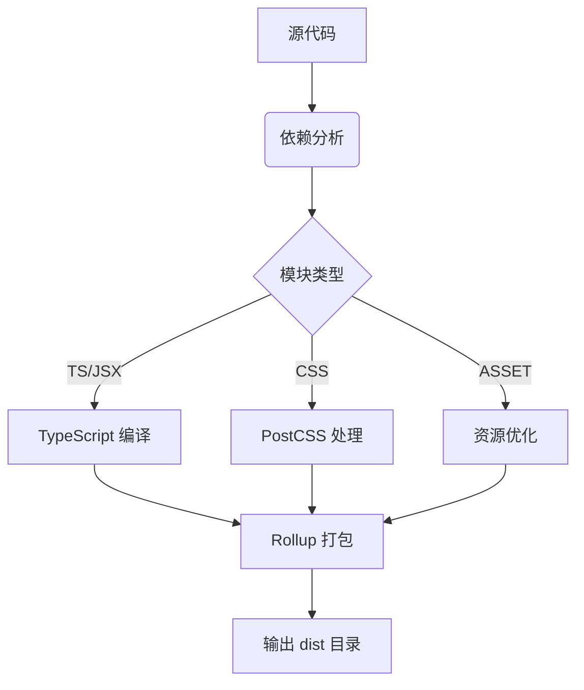

## Lumos 设计文档 v1.0

### 一、项目目标
1. 实现亚秒级冷启动的开发服务器
2. 支持零配置的现代前端技术栈
3. 提供可扩展的插件架构
4. 生成高度优化的生产环境包
5. 完善的 TypeScript 开箱即用支持

### 二、架构设计


#### 核心模块：
1. **Dev Server** - 基于原生 ES Module 的开发服务器
2. **Builder** - 生产环境打包引擎（基于 Rollup 改造）
3. **Plugin System** - 插件管理系统
4. **Dependency Resolver** - 智能依赖分析器
5. **HMR Engine** - 热模块替换系统

### 三、核心功能设计

#### 1. 开发服务器（Dev Server）
```typescript
// 核心中间件架构
const server = new Koa()
server.use(resolveMiddleware)  // 路径解析
server.use(cacheMiddleware)    // 模块缓存
server.use(transformMiddleware) // 模块转换
server.use(hmrMiddleware)      // 热更新
server.use(staticMiddleware)   // 静态资源服务
```

**关键技术点：**
- 原生 ES Module 动态导入
- 基于文件系统的时间戳缓存
- WebSocket 实时通信
- 智能依赖预构建（使用 esbuild 加速）

#### 2. 构建系统（Builder）


**优化策略：**
- 代码分割（Code Splitting）
- CSS/JS 代码压缩（Terser + SWC）
- 资源指纹（Content Hash）
- 预加载优化（Preload/Prefetch）

### 四、插件系统设计

#### 插件生命周期：
```typescript
interface LumosPlugin {
  name: string
  hooks: {
    config?: (config: Config) => Config
    transform?: (code: string, id: string) => TransformResult
    load?: (id: string) => LoadResult
    buildStart?: () => void
    generateBundle?: (bundle: Bundle) => void
  }
}
```

**内置插件：**
- TypeScript 支持（通过 SWC）
- React/Preact 支持
- CSS Modules
- 自动导入优化
- 依赖预构建插件

### 五、性能优化策略

| 优化维度        | 实现方案                          | 预期效果               |
|-----------------|-----------------------------------|------------------------|
| 冷启动速度      | esbuild 预构建依赖                 | < 500ms 启动时间       |
| 热更新          | 精准模块依赖追踪                   | < 50ms 更新延迟        |
| 生产构建        | 并行化 Rollup 构建                 | 构建速度提升 30%       |
| 内存占用        | 增量构建 + 文件系统缓存            | 内存占用降低 40%       |
| 网络请求        | HTTP/2 + 资源内联                  | 请求次数减少 60%       |

### 六、开发者体验设计

1. **智能配置系统**
```ts
// 自动识别项目类型
if (existsSync('tsconfig.json')) {
  applyTsPlugin()
}
if (existsSync('postcss.config.js')) {
  applyPostCSS()
}
```

2. **错误处理机制**
```tsx
// 友好的错误界面
[HMR] Connection lost. Reloading in 5s...
× 无法解析模块 'vue'
   at /src/main.js:42
   Did you mean '@/components/MyComponent.vue'?
```

3. **CLI 界面**
```bash
$ lumos --modern
🚀 启动开发服务器...
 ├─ 预构建依赖: vue, react, lodash-es
 ├─ 监听文件变化: 1234 个文件
 ├─ 本地服务: http://localhost:3000
 └─ 热更新已启用
```

### 七、技术选型

| 模块           | 技术选型          | 备注                          |
|----------------|-------------------|-------------------------------|
| 开发服务器     | Koa + ws          | 支持中间件扩展                |
| 依赖分析       | es-module-lexer   | 静态分析 ES Module 依赖       |
| TypeScript 编译| SWC               | 比 Babel 快 20x               |
| CSS 处理       | PostCSS + Lightning CSS | 支持现代 CSS 特性          |
| 构建系统       | Rollup + 自定义插件 | 优化 Tree-shaking 效果       |
| 文件监视       | Chokidar          | 跨平台文件系统监听            |

### 八、扩展方向

1. **SSR 支持**
```ts
// 服务端渲染配置示例
const ssrConfig = defineConfig({
  ssr: {
    entry: 'src/entry-server.ts',
    target: 'node18',
    optimizeDeps: ['react-dom/server']
  }
})
```

2. **WebContainer 集成**
```ts
// 在线 IDE 支持
const webContainer = createWebContainer({
  mountPoint: '#container',
  devServer: viteServer,
  editor: {
    theme: 'vs-dark',
    extensions: ['vue-language-server']
  }
})
```

3. **AI 辅助优化**
```ts
// 智能打包建议
aiAdvisor.analyze(bundle).then(reports => {
  console.log('💡 优化建议:')
  reports.forEach(r => console.log(` - ${r.suggestion}`))
})
```

---

这个设计方案既继承了 Vite 的核心优势，又在可扩展性、智能优化和开发者体验方面进行了创新。建议从开发服务器模块开始实现，逐步构建完整工具链，每个模块都应配备单元测试和性能基准测试。